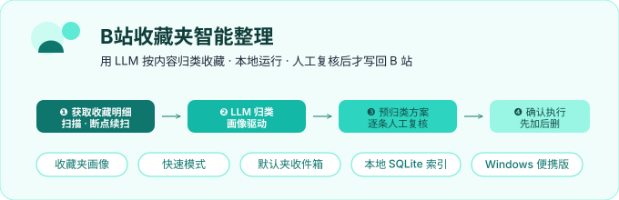
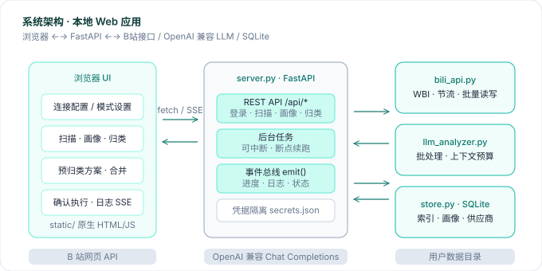
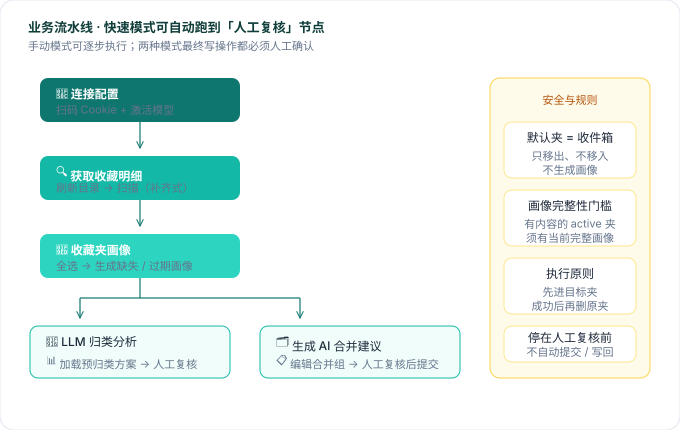
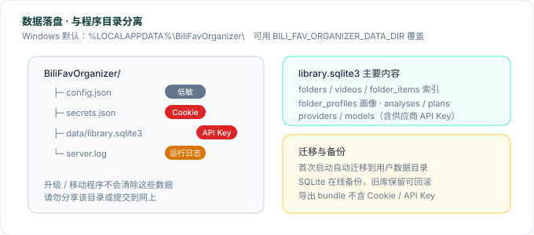

# B站收藏夹智能整理

<p align="center">
  
</p>

一个本地运行的 Web 工具：用 **LLM** 按**内容**把 B 站收藏夹里的视频自动归类到合适的收藏夹，并提供收藏夹画像与合并整理能力。

**核心原则**：归类方案必须人工复核后才执行；执行时先加入目标夹、成功后再从原夹删除；默认收藏夹是「未分拣收件箱」，只出不进。

---

## 它能做什么

| 能力 | 说明 |
|------|------|
| 🔍 获取收藏明细 | 扫码登录 / 手动 Cookie，拉取收藏夹与视频元数据，支持断点续扫 |
| 🧭 收藏夹画像 | 按完整扫描快照生成简介、主题、收纳范围；可预览后上传到 B 站简介 |
| 🤖 LLM 归类分析 | 依据画像批量推断每个视频的归属，并给出偏离提示 |
| 📊 预归类方案 | 可视化统计 + 逐条修改（移入 / 新建 / 跳过） |
| 🚀 确认执行 | B 站批量 `move` / 失效视频批量删除；风控时立即停 |
| 🗂 收藏夹整理 | AI 合并建议 + 可编辑草稿 + 人工复核后提交执行 |
| ⚡ 快速模式 | 自动串起「目录 → 扫描 → 画像 → 分析 / 合并建议」，停在人工复核前 |

---

## 快速开始

### Windows 便携版（推荐）

1. 打开 [Releases](https://github.com/Martin-soaring-dev/bili-fav-organizer/releases)，下载 `BiliFavOrganizer-Windows-x64-<版本标签>.zip`
2. 解压后双击 **`BiliFavOrganizer.exe`**（或 `BiliFavOrganizer.bat`）
3. 浏览器自动打开 **http://127.0.0.1:8080**

便携包已集成 Python 运行环境，无需另装 Python / pip。服务运行期间请保留控制台窗口，关闭窗口即停止。

> 请下载带版本标签的 Release 附件，不要下载 GitHub 自动打包的 `Source code.zip`（那是源码，不含运行环境）。

### 从源码运行（开发）

```bash
pip install -r requirements.txt
python server.py            # 默认 8080，可加 --port 8090
```

Windows 也可双击 **`BiliFavOrganizer.bat`**：首次会检查并安装 Python 3.13 与依赖，然后启动服务。

---

## 使用流程

**详细步骤**（手动模式；快速模式会自动跑到「人工复核」前）：

1. **🔌 连接配置**
   - Cookie：默认二维码登录，可切换手动输入；保存后点「测试 Cookie」
   - 模型：点「管理模型」添加供应商 / 填 API Key，保存并「激活」
   - [AMD Radeon Cloud Token Factory](https://developer.amd.com.cn/radeon/tokenfactory) 可用预设 + 平台 API Key

2. **⚡ 模式设置**
   - **快速模式**：选「内容整理」或「收藏夹整理」→ 点「开始自动整理」
   - **手动模式**：按下方各栏逐步自行操作

3. **🔍 获取收藏明细** → 「刷新收藏夹目录」→ 选扫描范围 → 「开始扫描」
   - 扫描方式默认「继续未完成/变化的夹」（补齐式）
   - 请求间隔默认 **2 秒**（固定间隔，无随机抖动）

4. **🧭 收藏夹画像** → 「全选 active」→ 「生成缺失 / 过期画像」
   - 默认收藏夹（未分拣收件箱）不生成画像，也不是移入目标
   - 画像是归类与合并的主要依据，收藏夹名称只是弱提示

5. **🤖 LLM 归类分析** → 设批大小 / 并发 → 「开始分析」
   - 开始前要求所有**有内容**的 active 夹都有当前完整画像
   - 发送前按上下文预算自动拆批；截断结果不采纳

6. **📊 预归类方案** → 「加载分析结果」→「查看详情」逐条确认

7. **🚀 确认执行** → 确认方案 → 设写操作间隔 → 「开始执行」
   - 明确失败会记录后继续；风控或结果不确定（`unknown`）时停止，需人工复核

---

## 系统架构

<p align="center">
  
</p>

| 模块 | 职责 |
|------|------|
| `server.py` | FastAPI 主程序：REST API、后台任务、SSE 事件 |
| `bili_api.py` | B 站网页接口封装：会话、节流、批量读写 |
| `llm_analyzer.py` | 归类 / 画像 / 合并建议；上下文预算与 TPM 限流 |
| `store.py` | SQLite：目录、视频索引、画像、方案、供应商模型 |
| `static/` | 原生 HTML / CSS / JS 单页 UI |

---

## 业务流水线与安全规则

<p align="center">
  
</p>

| 规则 | 说明 |
|------|------|
| 默认夹 = 收件箱 | 只移出、不移入；不生成画像 |
| 画像门槛 | 有内容的 active 夹必须有当前完整画像才能归类 / 合并 |
| 先加后删 | 先进目标夹，成功后再从原夹删除 |
| 快速模式 | 自动到「人工复核」为止，不自动提交方案、不自动写回 |

---

## 配置说明（config.json）

```json
{
  "base_url": "https://api.siliconflow.cn/v1",
  "model": "qwen3-8b",
  "scan_interval": 2,
  "scan_scope": "all",
  "write_interval": 2,
  "apply_batch": 1000,
  "analyze_batch": 20,
  "analyze_concurrency": 1,
  "analyze_max_tokens": 32768
}
```

| 字段 | 含义 |
|------|------|
| `base_url` | OpenAI 兼容接口地址（填到 `/v1`） |
| `active_model_id` | 当前激活模型的 SQLite ID（供应商 / Key / 规格在「管理模型」中管理） |
| `scan_interval` | 收藏夹请求最小间隔（秒），全局生效，默认 2 |
| `scan_scope` | `all` 全部 / `default` 仅默认夹 |
| `write_interval` | 执行阶段写操作固定间隔（秒），默认 2 |
| `analyze_batch` | 归类逻辑批大小上限（1~1000，默认 20） |
| `analyze_concurrency` | 同时 LLM 请求数（1~4，默认 1） |
| `analyze_max_tokens` / `model_context_tokens` | 以激活模型规格为准，此处仅兜底 |
| `model_tpm_limit` | 本地 TPM 预算（tokens/分钟），用于画像分批 |
| `profile_request_interval` | 画像请求最小间隔（秒） |

> **供应商 API Key 存在 SQLite `providers` 表；B 站 Cookie 在 `secrets.json`。**  
> `/api/config` 只回显 API Key **尾 4 位**。请勿分享主库、Cookie 或项目数据目录。

---

## 数据存储

<p align="center">
  
</p>

Windows 默认目录：`%LOCALAPPDATA%\BiliFavOrganizer\`（Win+R 输入该路径回车即可打开）。

| 文件 | 内容 |
|------|------|
| `config.json` | 应用设置 |
| `secrets.json` | B 站 Cookie |
| `data\library.sqlite3` | 收藏夹、视频索引、画像、方案、供应商 API Key |
| `server.log` | 最近一次运行日志 |

- 程序 ZIP 与数据目录分离；升级 / 移动程序不会清除数据
- 首次启动会把项目目录中的旧配置 / 旧 SQLite 迁移到用户数据目录（旧库保留可回滚）
- 可用环境变量 `BILI_FAV_ORGANIZER_DATA_DIR` 覆盖数据目录
- **换电脑**：页面「导出项目数据」→ 新电脑「读取项目数据」（不含 Cookie / API Key）；完整搬迁请私下复制整个数据目录
- 清理数据请用页面上的清除功能，不要手删文件

---

## 风控与中断

- 扫描与写操作默认 **2 秒**固定间隔（无随机抖动）
- 遇风控（`-101` / `-658` / `-352` / `412` 等）立即停止
- **可随时停止，再从断点继续**，不会白跑
- 同一视频在多个夹时，只保留首次扫描到的来源做删除

---

## 项目结构

```
bili-fav-organizer/
├── server.py                 # FastAPI 主程序
├── bili_api.py               # B 站接口封装
├── llm_analyzer.py           # LLM 归类 / 画像 / 合并
├── store.py                  # SQLite 数据层
├── static/                   # 前端单页
├── tests/                    # 单元测试
├── docs/
│   ├── images/               # README 图示
│   └── design/               # 实施方案
├── packaging/使用说明.txt
├── BiliFavOrganizer.bat/.ps1 # Windows 启动脚本
├── BiliFavOrganizer.spec     # PyInstaller 配置
└── requirements.txt
```

---

## 设计文档

| 文档 | 内容 |
|------|------|
| [docs/design/scan-sqlite-migration-plan.md](docs/design/scan-sqlite-migration-plan.md) | 扫描策略状态机、SQLite 迁移 |
| [docs/design/persistent-index-folder-profiles.md](docs/design/persistent-index-folder-profiles.md) | 持久索引、画像门槛、默认夹规则 |
| [docs/design/provider-api-compatibility.md](docs/design/provider-api-compatibility.md) | 供应商 API 差异与模型规格来源 |
| [docs/project-overview.md](docs/project-overview.md) | 项目全景梳理 |

---

## 开发

```bash
# 测试
python -m unittest discover -s tests -v

# Windows 便携打包（CI 在 tag v* 时自动执行）
pyinstaller --noconfirm --clean BiliFavOrganizer.spec
```

发布产物：`BiliFavOrganizer-Windows-x64-<tag>.zip` + SHA256。

---

## 致谢

本项目的开发过程得到了以下工具与模型的协助，在此表示感谢：

| 项目 | 简介 | 链接 |
|------|------|------|
| **小米 MiMo** | 小米大模型团队开源的系列大语言模型与智能体能力，可用于代码理解、生成与工程协作 | [GitHub · XiaomiMiMo](https://github.com/XiaomiMiMo) |
| **Qwen Code** | 阿里云通义千问团队的编程智能体 CLI，擅长仓库级代码阅读、修改与终端任务 | [GitHub · QwenLM/qwen-code](https://github.com/QwenLM/qwen-code) · [Qwen 官网](https://qwen.ai) |
| **ChatGPT** | OpenAI 的对话式 AI 助手，在方案讨论、文案与代码协作方面提供了帮助 | [chatgpt.com](https://chatgpt.com) · [OpenAI](https://openai.com) |

---

## 免责声明

- 本项目为**非官方**个人工具，与哔哩哔哩（bilibili）及其运营方**无任何关联**，亦未获其授权或认可。
- 本项目仅供个人学习与研究，**请勿用于商业用途**。
- 本项目仅在你本机运行、处理你自己的账号数据；请自行遵守哔哩哔哩用户协议及相关法律法规。
- 使用本工具产生的一切后果（包括但不限于账号风控、数据变更）由使用者自行承担。
- 本项目按「现状」提供，不附带任何明示或默示担保。

---

## 许可

见 [LICENSE](LICENSE)。
