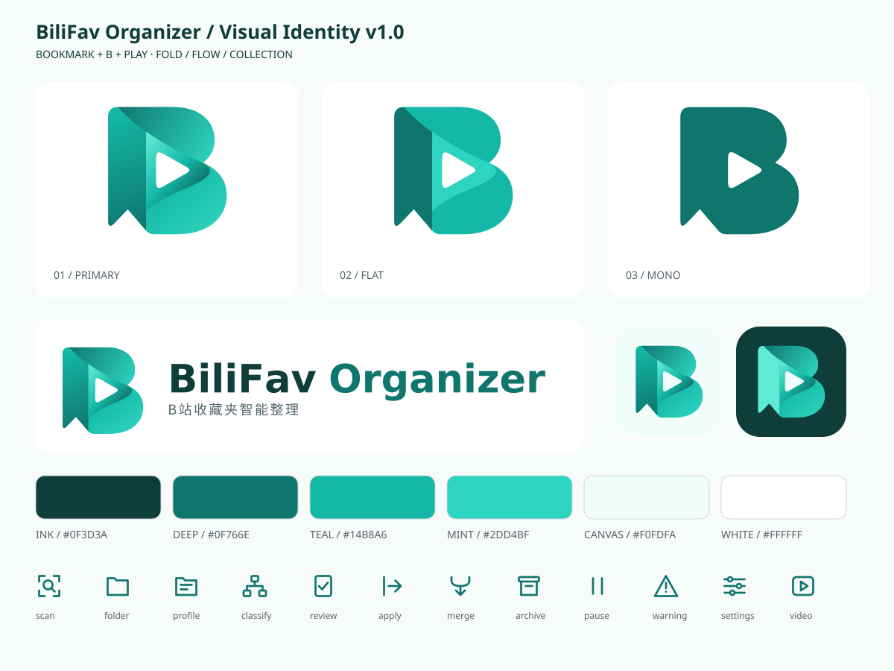

# BiliFav Organizer 品牌与视觉设计

版本 **1.0.0** · 2026-10-08 · 基于项目作者选定的青绿色「书签 B + 播放键」参考图重建。

这套设计交付同时包含品牌规范、SVG 构造语言、界面使用规则、可复用矢量资产和生成源。参考图是方向依据；本目录里的路径与令牌是 v1 的正式实现，采用几何重建，不是位图自动描摹，也不声称逐像素复刻参考图。



## 文档入口

| 文档 | 解决的问题 |
| --- | --- |
| [视觉识别规范](visual-identity.md) | 品牌定位、图形语义、标志组合、颜色、字体、尺寸、留白、使用禁则 |
| [SVG 设计语言](svg-language.md) | 母版坐标、路径、图层、渐变、负空间、图标网格、命名、可访问性与导出 |
| [应用与开发指南](implementation.md) | README、Web 顶栏、favicon、Windows、状态语义、设计令牌、维护验收 |
| [本地视觉预览](preview.html) | 主题切换、16–128 px 对比、组合标志、图标和界面示例；下载或克隆后打开 |
| [构造网格](construction.svg) | 标志母版、墨迹边界、书签节点与折叠分界 |

GitHub 会显示 Markdown 和 SVG；HTML 文件在 GitHub 上显示源码。预览不依赖外网，直接在本地浏览器打开 `docs/brand/preview.html`。

## 资产位置

业务设计方案继续保留在 `docs/design/`。品牌文档集中在 `docs/brand/`，前端可直接访问的资产集中在 [`static/brand/`](../../static/brand/)，避免文档与运行时各维护一套标志。

| 文件 | 用途 |
| --- | --- |
| `mark-gradient.svg` | 主标志，透明背景，折叠带渐变 |
| `mark-flat.svg` | 平涂多色标志，无渐变的媒体与文档 |
| `mark-mono.svg` / `mark-inverse.svg` | 深青绿单色 / 白色反白；播放键为透明孔 |
| `mark-compact.svg` | 小尺寸标志，移除折叠层，与单色版共用轮廓 |
| `lockup-horizontal.svg` / `lockup-stacked.svg` | 横式 / 竖式双语组合；英文和中文均转为路径 |
| `lockup-horizontal-inverse.svg` / `lockup-stacked-inverse.svg` | 深色背景组合，文字反白 |
| `wordmark.svg` | 英文路径字标，独立使用 |
| `app-icon-light.svg` / `app-icon-dark.svg` | 带圆角容器的应用图标；深色版有浅色书签和播放键 |
| `favicon.svg` | 适合 16–32 px 的固定浅底单色图标 |
| `icons/*.svg` | 12 个业务线条图标，可独立编辑 |
| `sprite.svg` | `bfo-mark` 和 12 个 `symbol`，供同源 Web 引用 |
| `tokens.json` / `tokens.css` | 品牌色、主题语义色、字阶、间距、圆角和动效参数 |
| `manifest.json` | SVG 资产清单和品牌版本 |
| `FONT-NOTICE.txt` / `NOTO-OFL.txt` | 英文及中文路径字标的字体来源与许可文本 |

## 重新生成

```bash
python tools/brand/build.py
python tools/brand/build.py --check
```

生成器只使用 Python 标准库，无需安装字体、前端构建工具或修改应用依赖。英文、中文轮廓源分别保存在 `tools/brand/wordmark-paths.json` 和 `descriptor-paths.json`；图形与令牌定义保存在 `build.py`。

本次交付接入 README 的品牌展示和文档入口。界面接入方法已给出，正式界面的配色、图标替换与 Windows 打包资源应按应用指南实施；本套文档不表示这些集成都已经上线。

新绘制的图形、文档和生成代码遵循仓库根目录 [LICENSE](../../LICENSE)。第三方字体相关材料保留其各自许可，详见资产目录中的两份字体声明。
