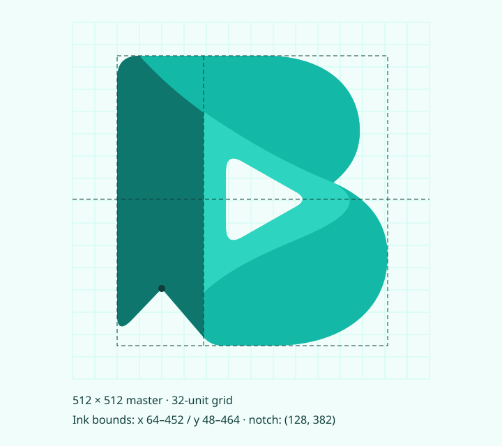

# 视觉识别规范

[返回品牌入口](README.md) · v1.0.0

## 1. 品牌定义

正式英文名 **BiliFav Organizer**，产品说明 **B站收藏夹智能整理**。目录、包名和仓库名可以沿用 `bili-fav-organizer`，不用于替代正式字标。英文大小写固定为 `BiliFav Organizer`；中文说明中的空格由排版决定，不改写其含义。

产品定位是本地运行、LLM 辅助、由用户复核和确认的个人视频收藏整理工具。品牌需要同时传达收藏、理解、组织与用户掌控；图形体现视频入口，界面文案体现「人工复核后执行」。未来拓展到其他内容源时可延续图形语言，但应单独评估品牌名称与中文说明。

气质关键词：清晰、有序、轻盈、可靠。大面积留白和有限色彩服务信息阅读；折叠带只用于品牌图形与少量展示区域，不扩散成整个工作界面的装饰。

## 2. 标志与语义

| 图形组成 | 视觉读法 | 产品关联 |
| --- | --- | --- |
| B 形轮廓 | 品牌首字母与双层内容容器 | BiliFav 的名称识别 |
| 左侧书签带、底部 V 形缺口 | 收藏、保留与回访 | 收藏夹作为长期管理对象 |
| 中部圆角播放孔 | 视频内容 | 当前核心内容类型 |
| 从左上经过中心的折叠带 | 内容流转、折叠收纳 | 内容经理解与复核进入有序收藏 |

标志不把任务调度、网络接口或模型画成流程图；扫描、归类、复核、执行这些具体动作由业务图标表达。B 形在较小尺寸优先于折叠质感，播放孔和书签缺口必须保留。

与选定参考图相比，v1 规范化了曲线、留白和渐变，去掉位图中的光晕、纹理和随机高光。品牌识别由明确的 SVG 路径承担。标志使用受控渐变，界面按钮、状态、正文及功能图标使用纯色。

## 3. 标志体系

| 版本 | 推荐用途 | 最小 CSS 显示尺寸 |
| --- | --- | --- |
| 渐变主标志 | README、启动页、品牌展示 | 48 × 48 px |
| 平涂多色版 | 文档图示、少色输出 | 32 × 32 px |
| 单色 / 反白版 | 工具栏、印刷、背景不均匀处 | 24 × 24 px |
| Compact / favicon | 浏览器标签、小菜单 | 16 × 16 px |
| 双语横式组合 | README、首页顶部、横幅 | 宽 440 px |
| 双语竖式组合 | 启动页、海报、居中版面 | 宽 360 px |
| 应用图标 | Windows、启动器、快捷方式 | 48 × 48 px；更小用 compact 衍生 |

横式组合的固定画布为 `856 × 190`，标志缩放为 0.34，字标从 x=204 开始，英文基线 y=98，中文基线 y=134。竖式组合为 `710 × 520`，英文基线 y=418，中文基线 y=475。不要单独移动组成部分重新拼装；需要无中文组合时使用独立标志和英文 `wordmark.svg`，并建立新的组合版本。

横式缩到 440 px 时中文字阶约 11.3 px；更窄的空间使用标志加 HTML 产品名，保持正文可读，不继续压缩整个组合。

## 4. 网格、比例与留白

- 母版画布：`512 × 512`，比例 1:1，图形墨迹边界 x=64–452、y=48–464。
- 墨迹宽高：388 × 416；折叠分界 x=188；书签缺口关键点 `(128, 382)`。
- 品牌安全区单位 **u=32**。标志外侧至少保留 1u，组合标志外侧同样按其标志缩放后的 1u 留白。
- 母版内部已有留白，置入外部容器时从墨迹边界衡量。其他文字、边线、角标不能侵入安全区。
- 应用图标 512 画布的外框圆角为 112。图形以 0.8 缩放，平移 `(51.2, 51.2)`。16–32 px favicon 使用 0.9 倍单色版，让小尺寸墨迹占比更充分。
- 必须等比缩放。允许按视觉居中微调外部容器，禁止拉宽 B、加深缺口、压扁播放孔、独立旋转折叠带。

墨迹中心 x=258、y=256，与画布中心仅差 2 单位；竖式组合采用 x 平移 189.88，使放大后的墨迹中心落在组合中心 x=355。

## 5. 色彩

| 名称 | HEX | 用途 |
| --- | --- | --- |
| Ink | `#0F3D3A` | 品牌文字、深色应用图标底 |
| Deep | `#0F766E` | 单色标志、浅底强调文字 |
| Teal | `#14B8A6` | 折叠带主体、装饰性色块 |
| Mint | `#2DD4BF` | 品牌高光、浅层结构 |
| Canvas | `#F0FDFA` | 品牌展示背景、浅色应用图标底 |
| White | `#FFFFFF` | 反白字标、纯白底 |
| Pale Mint | `#5EEAD4` | 折叠带起点、深色图标书签 |

英文路径字标 `BiliFav` 使用 Ink，`Organizer` 使用 Deep；反白版二者均为 White。中文说明在浅底使用 `#52656A`，深底使用 `#CCFBF1`。英文双色不能映射为任务成功与否。

展示区域的建议色彩分配：中性背景约 75%，深色文字约 15%，品牌与强调色约 10%。这是构图原则，不作为每个界面的硬性像素配额。

### 主题与对比度

| 前景 / 背景 | 计算对比度 | 设计决定 |
| --- | --- | --- |
| Deep / White | 5.47:1 | 可用于常规文字 |
| Teal / White | 2.49:1 | 用作装饰，不用于常规正文 |
| Mint / White | 1.86:1 | 用作色块或高光，不用于常规正文 |
| 浅色按钮白字 / `#087F6B` | 4.93:1 | 浅色主题主操作 |
| 深色按钮 `#052019` 字 / `#00D3A8` | 8.87:1 | 深色主题主操作 |
| 浅色说明 `#52656A` / White | 6.13:1 | 中文副标题、说明文字 |
| 深色次要文字 `#A1ADBA` / `#1A212B` | 7.10:1 | 深色说明文字 |

对比度按 sRGB 相对亮度计算，只覆盖表中的颜色对。动态叠层、禁用状态、其他主题背景需单独检查。品牌渐变不作为正文、按钮文字或状态文字的前景。暗色应用图标为固定容器版本，左书签改为 Pale Mint、播放孔垫 Canvas，保证主要形状在 Ink 底上清晰。

## 6. 字体与排版

| 层级 | 推荐字号 / 行高 | 字重与用途 |
| --- | --- | --- |
| 展示标题 | 40 / 48 px | 700，品牌与发布介绍 |
| 页面标题 | 28 / 36 px | 700 |
| 区块标题 | 20 / 28 px | 600 |
| 次级标题 | 16 / 24 px | 600 |
| 正文 | 14 / 22 px | 400 |
| 辅助说明 | 12 / 18 px | 400；承载关键步骤时用 14 px |

正式字标英文轮廓由 DejaVu Sans Bold 转换，中文轮廓由 Noto Sans CJK SC Regular 转换；固定字标全部是 `<path>`，显示不依赖用户字体，也不用于界面正文。

正文建议 `system-ui, 'Noto Sans CJK SC', 'Microsoft YaHei', sans-serif`；代码、视频 ID、路径与日志使用 `'Cascadia Code', Consolas, monospace`。目前应用的等宽字体界面继续由现有 `style.css` 控制；本规范提供后续排版方案，不自动更改它。

中文说明不人为拉大成难以阅读的逐字间隔。标志中的 3 单位字间距只用于固定中文路径字标。正文左对齐，数字统计用等宽数字；一屏中的字号层级控制在 3–4 种。

## 7. 界面视觉延伸

- 4 px 基础网格；常用间距 8、12、16、24、32；页面展示可用 48、64。
- 控件圆角 6 px，卡片 12 px，对话框 16 px；应用图标圆角单独定义，不套用卡片圆角。
- 普通卡片使用 1 px 边框。主要分区通过标题、间距和表面明度区分，不用持续发光。
- 品牌主图形使用面积与负空间，功能图标使用 1.8 单位线条；二者共用颜色，但不共用线宽。
- hover / focus / 展开过渡建议 120 / 180 / 240 ms；尊重 `prefers-reduced-motion`。标志默认静态，避免持续旋转或播放脉冲被误读为正在运行。

## 8. 使用禁则与品牌文案

不要拉伸、改轮廓、添加轮廓描边、随机替换渐变色、给播放孔加厚边、把组合标志置于复杂截图上、在 16 px 标志中保留所有渐变细节。不要把应用图标容器当成所有场景必须附带的背景。

图形强调整理能力，产品介绍保持准确：可以说「LLM 辅助归类」「人工复核后执行」「本地运行」；快速模式应表述为「自动生成待复核方案」，不能暗示无需确认就写回账户。面向用户的介绍应保持独立项目身份。

## 9. 维护

v1.0.0 为第一套规范化交付。外轮廓、品牌名称、字标结构发生变化提升主版本；新增官方组合或图标提升次版本；修复导出、说明与渲染问题提升补丁版本。变更时同步本页、令牌版本、manifest 和预览，使用生成器更新衍生文件。
