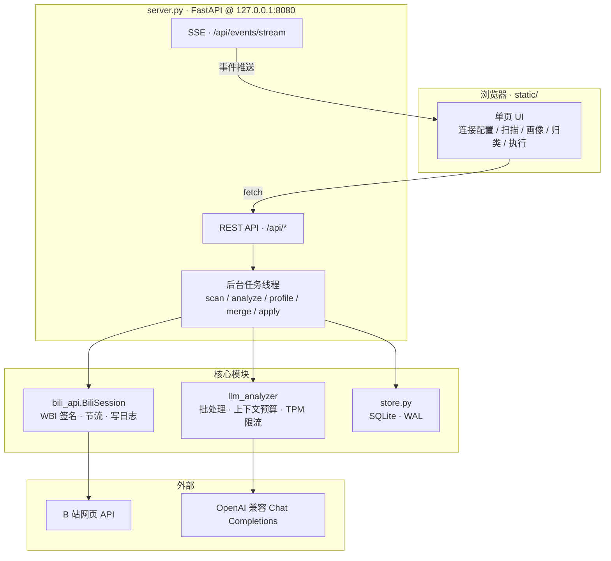
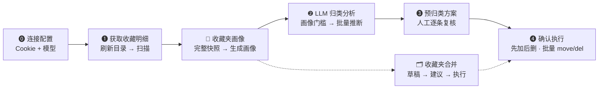

# 项目梳理 · B站收藏夹智能整理

> 整理日期：2026-09-26  
> 代码版本：`main` @ `22c8ee4`（Merge pull request #1 from Martin-soaring-dev/mimo-beta）  
> 仓库：https://github.com/Martin-soaring-dev/bili-fav-organizer

---

## 1. 项目是什么

本地运行的 Web 工具：用 **LLM** 把 B 站收藏夹里的视频按**内容**自动归类到合适的收藏夹，并提供收藏夹画像与合并整理能力。

**核心原则**（贯穿全流程）：

| 原则 | 说明 |
|------|------|
| 人工复核 | 归类方案必须人工确认后才执行，无全自动写操作 |
| 先加后删 | 执行时先加入目标夹，成功后才从原夹删除，避免丢数据 |
| 画像驱动 | 归类依据是「收藏夹画像」（实际内容），夹名只是弱提示 |
| 默认夹 = 收件箱 | 「默认收藏夹」只出不进：不生成画像、永远不是移入目标 |
| 本地优先 | Cookie / API Key / 索引全部存在本机，不外传 |
| 风控节流 | 扫描/写操作全局间隔，可随时停止并断点续跑 |

---

## 2. 仓库结构

```
bili-fav-organizer/
├── server.py              # FastAPI 主程序（~3530 行）· HTTP API + 后台任务编排
├── bili_api.py            # B 站网页 API 封装（~960 行）· Cookie/WBI/收藏夹读写
├── llm_analyzer.py        # LLM 归类与画像生成（~1200 行）· 批处理/上下文预算/限流
├── store.py               # SQLite 数据层（~1240 行）· 迁移/索引/画像/供应商模型
├── static/                # 前端（原生 HTML/CSS/JS，无构建）
│   ├── index.html         # 单页 UI（~30 KB）
│   ├── app.js             # 交互逻辑（~142 KB）
│   └── style.css          # 样式（~32 KB）
├── tests/                 # 单元测试（unittest，26 个用例）
├── docs/
│   ├── design/            # 实施方案（扫描/SQLite、持久索引、供应商兼容）
│   └── project-overview.md        # 本文档
├── packaging/使用说明.txt  # Windows 便携版说明
├── .github/workflows/release-windows.yml   # tag 触发 PyInstaller 打包
├── BiliFavOrganizer.bat/ps1   # Windows 启动脚本
├── BiliFavOrganizer.spec   # PyInstaller 配置
├── config.json            # 应用设置（运行时在用户数据目录）
├── secrets.json           # B 站 Cookie（运行时在用户数据目录）
└── requirements.txt       # fastapi / uvicorn / requests / qrcode / browsercookie …
```

**体量**：后端约 5700 行 Python，前端约 1700 行 JS + HTML/CSS，测试约 350 行。

---

## 3. 运行架构



**数据落盘位置**（Windows）：`%LOCALAPPDATA%\BiliFavOrganizer\`

| 文件 | 内容 | 敏感度 |
|------|------|--------|
| `config.json` | 应用设置 | 低 |
| `secrets.json` | B 站 Cookie | **高** |
| `data/library.sqlite3` | 收藏夹/视频索引/画像/方案/供应商 API Key | **高** |
| `server.log` | 最近一次运行日志 | 中 |

可用环境变量 `BILI_FAV_ORGANIZER_DATA_DIR` 覆盖数据目录。  
首次启动会把项目目录中的旧 `config.json` / `secrets.json` / `data/library.sqlite3` 迁移到用户数据目录（SQLite 用在线备份，旧库保留）。

---

## 4. 模块职责

### 4.1 `server.py` — 应用主程序

| 职责 | 说明 |
|------|------|
| HTTP API | 约 62 个路由，覆盖登录、配置、扫描、画像、分析、方案、执行、合并 |
| 后台任务 | `scan_run` / `analyze_run` / `folder_profile_run` / `folder_merge_run` / `apply_run` 全局状态 + 可中断 |
| 事件总线 | `emit()` + SSE 推送，前端日志/进度实时刷新 |
| 凭据隔离 | `secrets.json` 单独存放；`/api/config` 只回显 API Key 尾 4 位 |
| 数据导入导出 | JSON bundle（不含 Cookie / API Key） |

**主要 API 分组**：

| 分组 | 路由前缀 | 功能 |
|------|----------|------|
| 登录 | `/api/login/qr/*`, `/api/cookie`, `/api/login/status` | 二维码登录 / 手动 Cookie / 登录态 |
| 配置 | `/api/config`, `/api/providers/*`, `/api/models/*` | 设置、供应商、模型管理与测试 |
| 扫描 | `/api/folders`, `/api/scan/*`, `/api/library/*` | 目录刷新、扫描、本地内容树 |
| 画像 | `/api/folder-profiles/*`, `/api/organization/readiness` | 生成/删除/上传简介、就绪门槛 |
| 归类 | `/api/analyze/*`, `/api/plan/*` | LLM 分析、预归类方案、确认 |
| 合并 | `/api/folder-organize/*` | 合并草稿/建议/执行 |
| 执行 | `/api/apply/*` | 批量 move/delete |
| 数据 | `/api/data/*`, `/api/status` | 导出/导入/清除、运行统计 |

### 4.2 `bili_api.py` — B 站接口层

- **认证**：Cookie 解析（手动/浏览器读取）、CSRF（bili_jct）、WBI 签名（`_wbi_sign`）
- **读取**：`list_folders` / `get_folder_info` / `iter_folder_videos`（分页）/ `get_folder_resource_ids` / `get_resource_infos_bulk`
- **写入**：`create_folder` / `rename_folder` / `update_folder_intro` / `delete_folder` / `clean_invalid_folder` / `add_to_folder` / `move_batch` / `batch_delete`
- **安全**：读写全局节流、风控错误（`RateLimitedError`）立即停、不确定写（`WriteUncertainError`）标记 `unknown` 人工复核、写操作 JSONL 审计日志

**扫描策略**（见 design/scan-sqlite-migration-plan.md）：

```
media_count ≤ 1000  →  resource/ids + resource/infos 批量元数据
media_count > 1000  →  resource/list 分页（ps=20，has_more）
任一路径不完整      →  回退分页明细，完成性校验通过才标 complete
```

### 4.3 `llm_analyzer.py` — LLM 层

| 能力 | 说明 |
|------|------|
| `LLMConfig` | base_url / api_key / model / 上下文与输出上限 / TPM |
| `LLMAnalyzer` | 内容归类：批量打包视频 → 系统提示（含收藏夹画像）→ JSON 结果 |
| `generate_folder_profile` | 收藏夹画像：全量样本 → 超预算分页压缩 → 合并为简介/主题/范围/一致性 |
| `suggest_folder_merges` | 合并建议：基于画像 + 代表条目 + 重复关系 |
| 上下文预检 | 估算 token、安全余量（≥512 或 15%）、不足时二分拆批 / 下调输出；`finish_reason=length` 不采纳 |
| TPM 限流 | `_wait_for_profile_request_slot` 按模型 TPM 分配预算，实际用量回写修正 |
| 供应商兼容 | `max_tokens` vs `max_completion_tokens`（MiMo）；`thinking` 参数翻译 |

### 4.4 `store.py` — 数据层

SQLite（WAL 模式），表结构：

| 表 | 作用 | 主键 |
|----|------|------|
| `folders` | 收藏夹目录（active/archived、`directory_order`） | `media_id` |
| `videos` | 视频元数据索引（跨夹共享，按资源 ID upsert） | `resource_key` |
| `folder_items` | 当前收藏夹成员关系（扫描快照） | `(media_id, resource_key)` |
| `folder_scan_state` | 每夹扫描状态（never/partial/complete、策略、游标） | `media_id` |
| `scan_stage` | 扫描中间结果（断点续扫） | `(scan_run_id, media_id, resource_key)` |
| `folder_profiles` | 收藏夹画像（绑定快照时间/版本） | `media_id` |
| `analyses` | 归类分析结果（`status=stale` 表示画像已变需重算） | `resource_key` |
| `plans` | 已提交的预归类方案 | `resource_key` |
| `providers` / `models` | LLM 供应商与模型配置（含 API Key） | `id` |
| `app_state` | 各类任务状态 JSON（扫描选择/执行状态/合并草稿…） | `name` |

Schema 版本迁移：`schema_migrations` 表 + 启动时幂等升级（当前 v6：分析 `status`/`dependent_ids`）。

### 4.5 前端 `static/`

单页应用，原生 JS（无框架/构建），UI 分区：

1. **🔌 连接配置** — 二维码/手动 Cookie、供应商/模型管理
2. **🔍 获取收藏明细** — 刷新目录、扫描范围、断点续扫
3. **🧭 收藏夹画像** — 生成/重建/删除画像、上传简介到 B 站
4. **🗂 合并组草稿** / **📋 已提交合并任务** — 收藏夹整理
5. **🤖 LLM 归类分析** — 批大小/并发/最大输出、开始/停止
6. **📊 预归类方案** — 统计、逐条修改、确认方案
7. **🚀 确认执行** — 分组执行、写操作间隔、unknown 复核

另有：本地内容树（`library-pane`）、模型管理（`manage-pane`）、运行日志（SSE）、主题切换、数据导入/导出/清除。

---

## 5. 核心业务流程



### 5.1 画像完整性门槛（硬约束）

开始归类 / 合并前，服务端要求：

- 每个**有内容的 active 收藏夹**都有扫描 `complete` 快照
- 画像匹配当前 `media_id` + 名称 + 成员数 + 快照时间
- 画像字段完整：非空简介、≥2 主题、典型内容、范围外提示、有效性、置信度 0~1
- **空收藏夹**不作为整理目标；**默认收藏夹**不要求画像、不可作移入目标

不满足时 `/api/organization/readiness` 返回 `ready=false` 并列出缺失项，前端禁用相关按钮。

### 5.2 归类结果生命周期

- 分析落库时冻结 `dependent_ids`（当时参考了哪些夹）
- 画像重建 / 扫描快照变化 → 相关 `analyses` 标 `stale`，需重算
- 已 `stale` 的旧结论不能确认成新方案；执行前再比对提交方案保存的画像版本

### 5.3 执行阶段状态机

| 状态 | 含义 |
|------|------|
| 待操作 | 进入执行清单 |
| `done` | 明确成功，不自动重发 |
| `failed` | 明确失败，记录后继续下一批 |
| `unknown` | 超时/无响应，**停止**，需人工复核后移回待操作 |
| 风控 | 立即停止整个任务 |

---

## 6. 测试现状

```
tests/
├── test_batch_api.py           7 用例 · 批量请求 payload / 错误分类  ✅
├── test_batch_executor.py      2 用例 · 分组执行 / uncertain 停止   ❌ 2 ERROR
├── test_default_folder_inbox.py 12 用例 · 默认夹检测/守卫/就绪/删画像 ✅
├── test_folder_organize_plan.py 3 用例 · 合并计划                    ⚠️ 1 ERROR + 1 FAIL
└── test_scan_selection.py      1 用例 · 扫描选择往返                 ✅
```

**汇总：26 个用例，22 通过，1 失败，3 错误。**

| 问题 | 用例 | 现象 | 可能原因 |
|------|------|------|----------|
| ERROR | `test_groups_and_executes_in_batches`<br/>`test_uncertain_batch_stops_and_requires_review` | `server.APP["apply_run"]` 为 `None` | 测试未正确初始化 `APP["apply_run"]`，或执行器入口签名/初始化方式已变 |
| ERROR | `test_preserves_completed_identical_group` | 返回 `JSONResponse` 不可下标 | 测试仍按 dict 断言，接口已改成 FastAPI `JSONResponse` |
| FAIL | `test_rejects_target_as_source` | 期望 400，实际 409 | 冲突语义改为 409，测试未同步 |

> 这些是**测试与实现不同步**，不是核心业务逻辑回归的直接证据；但执行器与合并计划属于高风险写路径，建议优先修复。

---

## 7. 构建与发布

| 环节 | 说明 |
|------|------|
| 源码运行 | `python server.py` 或 `BiliFavOrganizer.bat`（Windows 自动装 Python + 依赖） |
| 便携打包 | PyInstaller（`BiliFavOrganizer.spec`）→ `dist/BiliFavOrganizer/` |
| CI/CD | `.github/workflows/release-windows.yml`：tag `v*` → 构建 → 拒绝打包本地数据 → ZIP + SHA256 → GitHub Release |
| 产物命名 | `BiliFavOrganizer-Windows-x64-<tag>.zip` |
| 依赖 | fastapi, uvicorn, requests, pydantic, qrcode[pil], browsercookie, pycryptodomex |

---

## 8. 安全与隐私要点

1. **Cookie** 仅存 `secrets.json`，扫码登录或手动输入，不走浏览器自动读取（Chrome ABE 加密会失败）。
2. **API Key** 存 SQLite `providers` 表；`/api/config` 只回显尾 4 位。
3. **导出 bundle** 不含 Cookie / API Key / 供应商配置。
4. **写审计**：所有 B 站写操作记入 `write_operations.jsonl`。
5. **风控**：扫描与写操作默认 2s 固定间隔（无随机抖动）；遇 -101/-658/-352/412 等立即停。
6. **数据目录** 与程序 ZIP 分离；升级/移动程序不清数据；换电脑需重新登录或私下复制数据目录。

---

## 9. 设计文档索引

| 文档 | 内容 |
|------|------|
| `docs/design/scan-sqlite-migration-plan.md` | 扫描策略状态机、SQLite 迁移、完成性校验 |
| `docs/design/persistent-index-folder-profiles.md` | 持久视频索引、夹生命周期、画像门槛、上下文预检、默认夹规则 |
| `docs/design/provider-api-compatibility.md` | 供应商 API 差异（max_tokens / max_completion_tokens / 模型元数据来源） |

---

## 10. 技术债与改进建议

### 高优先级（影响正确性/可维护性）

1. **修复失败测试**（4 个）：`test_batch_executor` 初始化 `APP["apply_run"]`、`test_folder_organize_plan` 适配 `JSONResponse` 与 409 语义。写路径没有测试保护风险较高。
2. **`server.py` 过大**（3500+ 行）：建议按路由域拆分（auth / config / scan / profile / analyze / plan / merge / apply），便于测试与协作。
3. **`app.js` 过大**（142 KB / 570+ 函数级定义）：可按 UI 分区拆模块，或至少用 IIFE/模块化分段。

### 中优先级

4. **前端无类型/无构建**：功能少时够用，但状态同步（`APP` 运行态、方案状态、画像新鲜度）已较复杂，可考虑轻量框架或至少 JSDoc 类型。
5. **测试覆盖缺口**：缺 `llm_analyzer`（上下文预算/拆批/截断处理）、`store` 迁移、画像门槛、扫描状态机的单测。
6. **手动测试依赖真实 B 站 / LLM**：可加 mock 层或契约测试，减少实机回归成本。

### 低优先级

7. **`data/` 目录残留 JSON**（`analysis.json`、`folders.json` 等）：迁移后可能只是历史兼容，可确认后清理或在文档标注「仅迁移用」。
8. **`server.log` 在仓库中**：建议加入 `.gitignore`（当前已有 `secrets.json`/`data/` 忽略规则，需确认 log）。
9. **依赖版本未锁定**：`requirements.txt` 无版本号，便携版构建结果可能随上游漂移，CI 可考虑 `pip freeze` 产物或 `requirements.lock`。
10. **文档语言混杂**：`provider-api-compatibility.md` 为英文，其余为中文；统一或双语皆可，建议在每篇文档开头标明语言。

---

## 11. 快速上手路径

```bash
# 开发
pip install -r requirements.txt
python server.py --port 8080
# 打开 http://127.0.0.1:8080

# 测试
python -m unittest discover -s tests -v

# Windows 一键
BiliFavOrganizer.bat
```

**首次使用顺序**：连接配置（扫码 + 选模型）→ 刷新目录 → 扫描 → 生成画像 → 归类分析 → 复核方案 → 确认执行。

---

## 12. 状态一览

| 维度 | 状态 |
|------|------|
| 核心四阶段流程 | ✅ 完整可用 |
| 收藏夹画像 + 合并整理 | ✅ 已实现 |
| SQLite 迁移 + 持久索引 | ✅ 已实施 |
| 默认夹收件箱规则 | ✅ 有测试保护 |
| Windows 便携发布 | ✅ CI 自动化 |
| 测试通过率 | ⚠️ 22/26（4 个需修） |
| 模块化/可维护性 | ⚠️ 后端单文件过大 |
| 供应商兼容层 | ✅ 有设计文档 + 特判 |

---

*本文档是项目全景梳理，供新人上手与后续重构参考。实现细节以源码与 `docs/design/` 为准。*
