# B站收藏夹智能整理：图文快速上手

适用 **v0.204**。照着截图从下载开始，先学快速模式，再看完整的手动流程。截图里的收藏夹、视频和密钥都是虚构样例；二维码不可扫码。B站登录与模型服务分别配置一次即可。

> **先记住这两点**：AI 只给整理建议；确认方案并点击执行后，程序才会修改 B 站收藏夹。AI 分析会把所需的视频资料发送到你选定的模型供应商，请先阅读对应平台的额度与数据政策。

## 1. 下载、启动并登录 B 站

### 下载 Windows 便携版

打开[最新 Release](https://github.com/Martin-soaring-dev/bili-fav-organizer/releases/latest)，在 **Assets** 下载带版本号的 `BiliFavOrganizer-Windows-x64-版本.zip`。例如 v0.204 是 `BiliFavOrganizer-Windows-x64-v0.204.zip`。不要下载 `Source code.zip`，它不是可运行程序；`.sha256` 是校验文件。

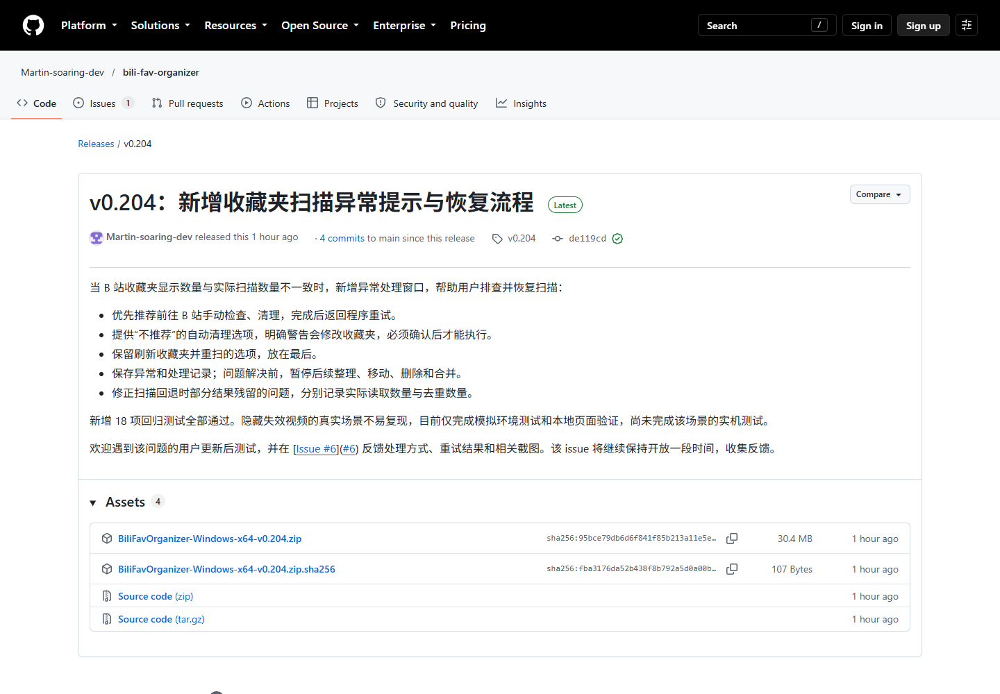

把 ZIP 完整解压到一个可写入的文件夹，双击 `BiliFavOrganizer.exe` 或 `BiliFavOrganizer.bat`。浏览器会打开 <http://127.0.0.1:8080>；如果没有自动打开，就手动输入这个地址。**保持黑色控制台窗口运行**，关闭它会停止本地服务。便携版已带 Python 运行环境，不用另装 Python。

### 用手机 B 站 App 扫码登录

在页面的“连接配置”里保持“二维码登录（推荐）”，用手机 B 站 App 扫描程序生成的二维码，并在手机上确认。成功后可点“测试 Cookie”验证登录状态。二维码过期时点“刷新二维码”再扫。

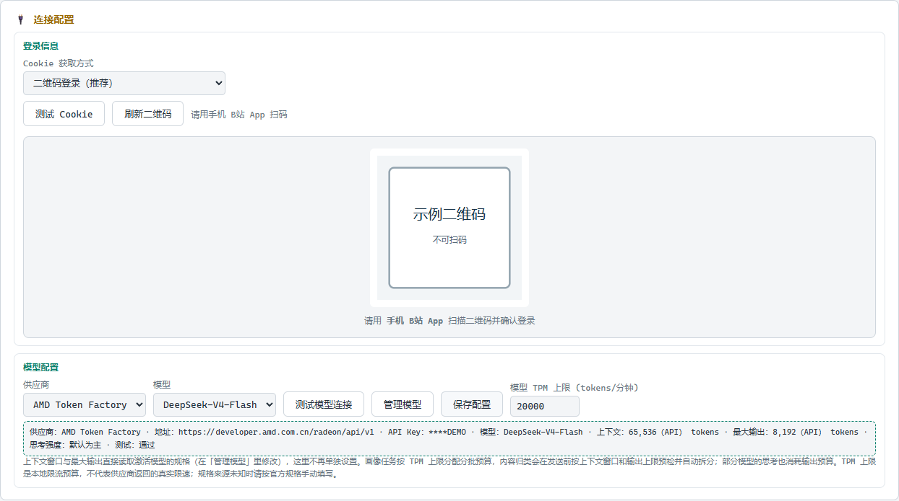

Cookie 是登录凭据，只保存在本机。不要截图或分享 Cookie，也不要把 `secrets.json` 发给别人。

<!-- pagebreak -->

## 2. 选择模型服务并完成配置

本应用推荐 **AMD Token Factory** 和 **硅基流动 SiliconFlow**。先选一家就能开始；以后可以在“管理模型”里切换。B站登录和模型配置是两回事，两边都要准备好。

### 推荐一：AMD Token Factory

打开 [AMD Token Factory](https://developer.amd.com.cn/radeon/tokenfactory)，登录后在 **Public Free Model APIs** 选择一个模型，再按页面说明获取 API Key。此应用调用的是 AMD 的共享模型 API：**免费试用，不需要启动 GPU 实例，也不消耗实例积分**。

共享服务有账号调用额度、每分钟请求数和并发限制；服务繁忙时可能限流，模型列表也会变化。具体剩余额度以账号页面和接口返回为准。AMD 将这项 API 定位为试用、开发和原型服务，不提供生产服务的 SLA；不要向它发送机密资料。额度和实例积分是两套东西，使用此应用不需要租用 AMD GPU 实例。详见 [AMD 模型 API 说明](https://amd-aim.github.io/radeon-cloud-docs/guides/model-apis/)、[额度查询](https://amd-aim.github.io/radeon-cloud-docs/api/usage/)和 [API 使用条款](https://amd-aim.github.io/radeon-cloud-docs/api/terms/)。

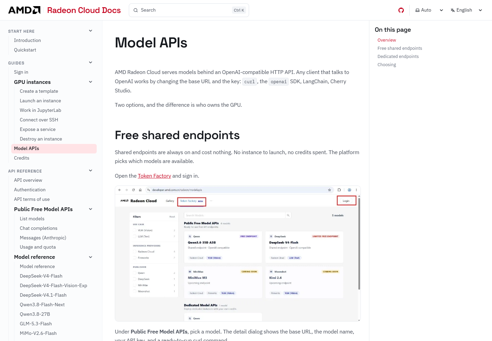

<!-- pagebreak -->

### 推荐二：硅基流动 SiliconFlow

如果你准备注册硅基流动，请从[我的邀请链接](https://cloud.siliconflow.cn/i/PjirZAsm)进入。按硅基流动目前公布的“推荐官”计划，新用户需完成注册和有效的首次实名认证；邀请人需完成实名认证并在活动中心成为“推荐官”。符合条件后，**你和我各获得 16 元通用代金券**。新用户完成实名认证后，还可在“活动中心 → 认证专享礼”查看并手动领取另一张 16 元券。活动公告目前写明持续至 **2026 年 12 月 31 日**；奖励资格、金额和券的有效期以注册时的平台规则及账户页面为准。官方说明：[推荐官计划](https://www.siliconflow.cn/developer-talk/od7wj9rr23p95uhihmhrombp)。

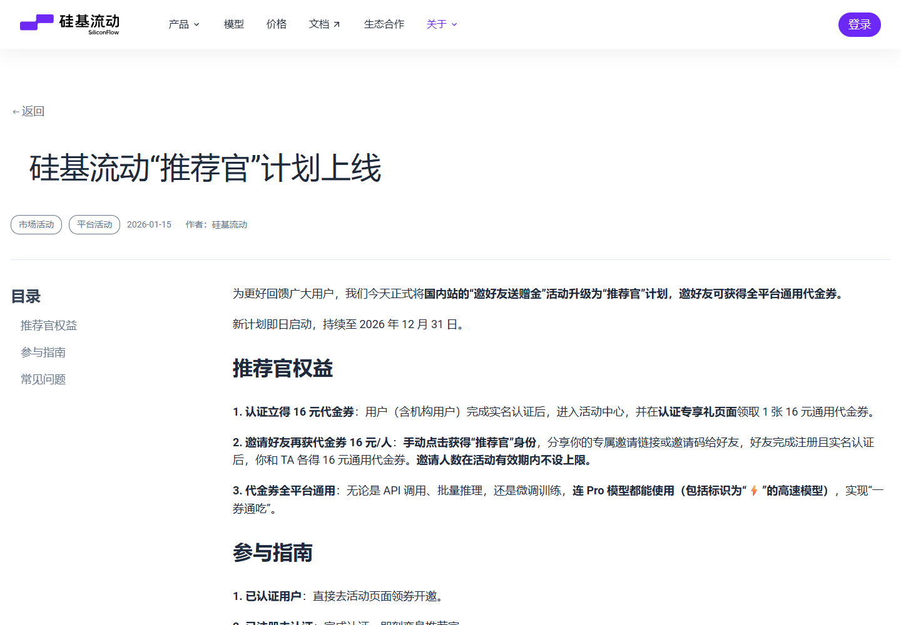

注册并拿到 API Key 后，可在模型广场查看模型、价格和可用余额。代金券用完后是否产生费用，取决于你选择的模型和账户余额；使用前先确认控制台显示的价格。

### 在应用里添加、测试并激活模型

1. 点“管理模型”，在左下“快速添加预设”选择 **AMD Token Factory** 或 **SiliconFlow**，再点“添加”。
2. 选中新供应商，在 API Key 位置填入你从该平台复制的密钥，点“保存”。预设已填好服务地址，不要把 API Key 填进模型名称。
3. 点模型区域的“刷新”，勾选要使用的模型，再点“保存所选”。刷新只是读取列表，保存所选后模型才会进入本机配置。
4. 点“测试”，只勾选准备使用的模型并点“开始测试”。绿色状态表示测试通过。点模型名称并“激活”，然后点“完成”；回到主页面再点“保存配置”和“测试模型连接”。

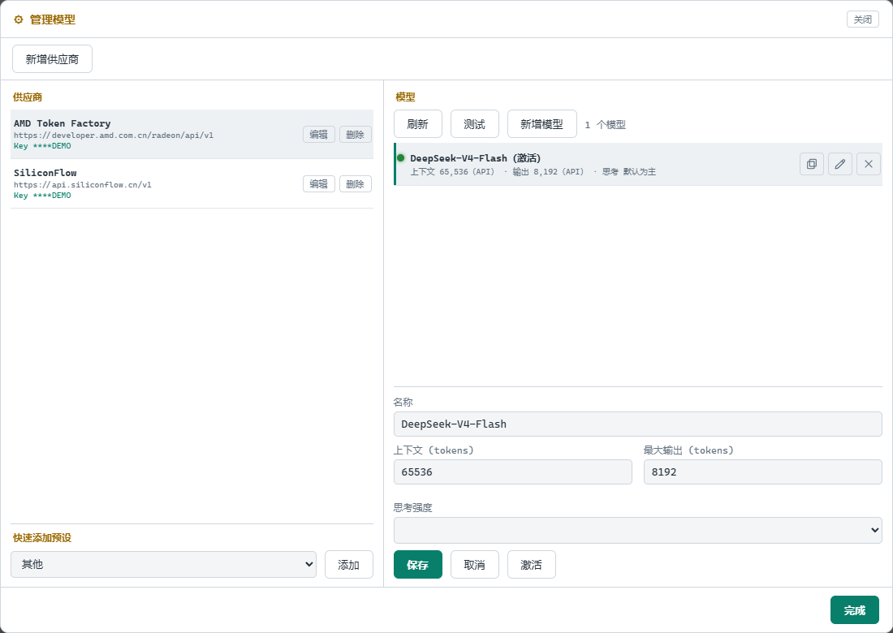

API Key 会保存在本机，界面只显示脱敏尾号。模型名称及上下文等参数以供应商当前目录和官方规格为准；第一次使用先保留默认批大小、并发和请求间隔。若使用 AMD，免费共享 API 的可用量会变化；若收到限流，等待额度恢复或切换供应商。

<!-- pagebreak -->

## 3. 快速模式：先让应用自动跑到方案复核

快速模式适合第一次使用：它自动刷新收藏夹目录、扫描全部收藏夹、补齐画像，再生成内容归类建议或收藏夹合并建议。第一次全量扫描会花较久；之后主要复用本机索引并补充变化。

开始前确认 B 站已登录、模型已激活。选择一个业务并点“开始自动整理”。快速模式不会替你确认或执行方案。

### A. 内容整理：给视频生成归类建议

在“业务”中选“内容整理”。应用会完成扫描、画像和 AI 归类，然后把你带到“内容整理”。

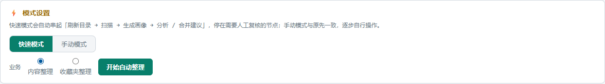

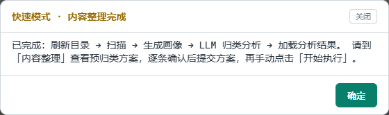

<!-- pagebreak -->

完成提示出来后，关闭提示，到“内容整理”点“加载分析结果”→“查看详情”。逐条核对视频和目标收藏夹；不合适的目标可以修改，不确定的可以跳过。无效视频默认不会自动删除。

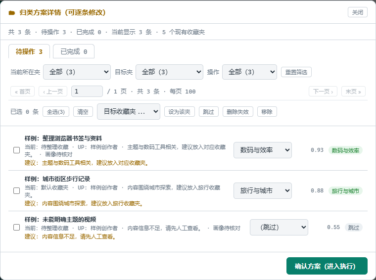

点“确认方案（进入执行）”后，再点“开始执行”才会把方案写入 B 站。执行前请最后核对目标和删除项；完成后到 B 站检查结果。若日志提示结果不确定，先核对 B 站实际状态，再决定如何继续。

<!-- pagebreak -->

### B. 收藏夹整理：生成合并建议

在“业务”中选“收藏夹整理”。应用会扫描并更新画像，再生成收藏夹合并草稿。

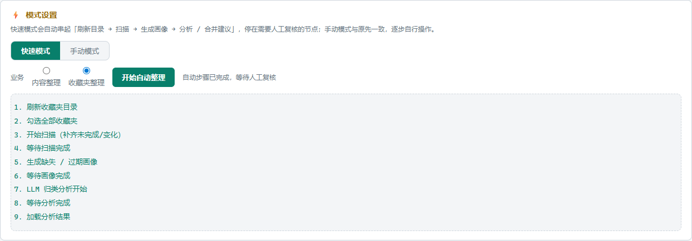

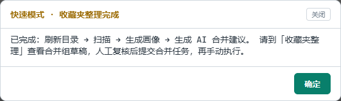

到“收藏夹整理”查看草稿里的目标收藏夹、来源收藏夹和最终名称。特别检查“清空后删除来源夹”是否符合你的想法；取消勾选可以保留空的来源夹。确认草稿后点“提交合并任务”，再点“执行已提交任务”。合并会移动 B 站收藏内容，执行前请确认来源和目标。

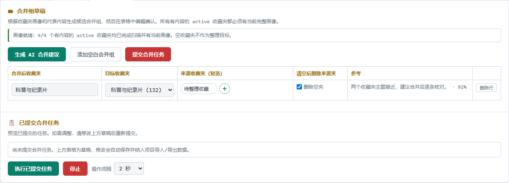

<!-- pagebreak -->

## 4. 进阶手动模式：自己控制完整工作流

手动模式适合想逐步检查结果的用户。它与快速模式使用相同的本地扫描和画像数据，但每一步由你单独启动。

### 第一步：刷新目录并选择扫描范围

切换“手动模式”，点“刷新收藏夹目录”，再点“选择扫描范围”。首次建议把之后可能作为整理目标的收藏夹都选上；内容整理依赖所有有内容的 active 收藏夹都有完整扫描和当前画像。默认收藏夹是未分拣收件箱，不需要生成画像。

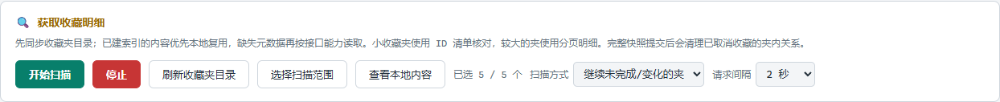

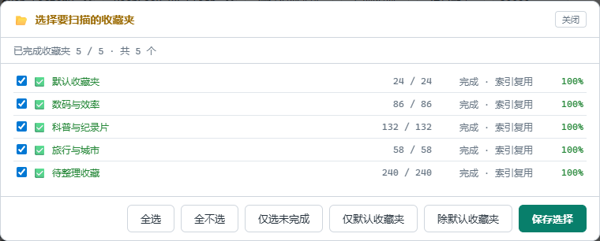

点“保存选择”，扫描方式先保留“继续未完成/变化的夹”，请求间隔保留默认 2 秒，再点“开始扫描”。首次扫描会建立本地索引；扫描异常未解决前，画像、归类和合并会暂停。

### 第二步：生成收藏夹画像

切换到“收藏夹画像”，点“刷新列表”→“全选 active”→“生成缺失 / 过期画像”。默认收藏夹会显示为未分拣收件箱，不会生成画像。只有扫描完整的收藏夹才能得到画像；画像概括主题与适合收纳范围，供后续分类参考。

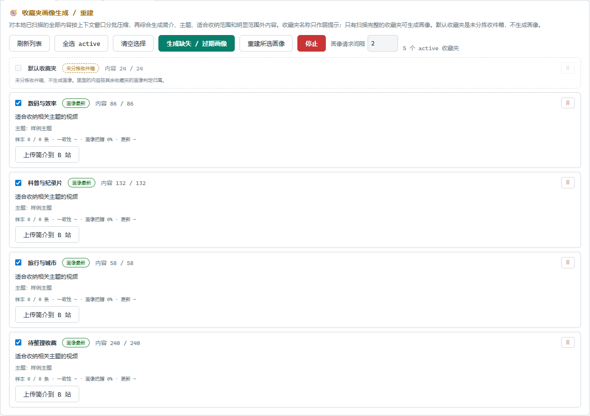

### 第三步：分析视频并逐条确认

打开“内容整理”，点“开始分析”。第一次保留默认批大小、并发和“不重建（仅分析新增）”。分析完成后点“加载分析结果”→“查看详情”。逐条确认当前收藏夹、建议目标和视频内容；修改错误建议，无法判断的设为“跳过”。

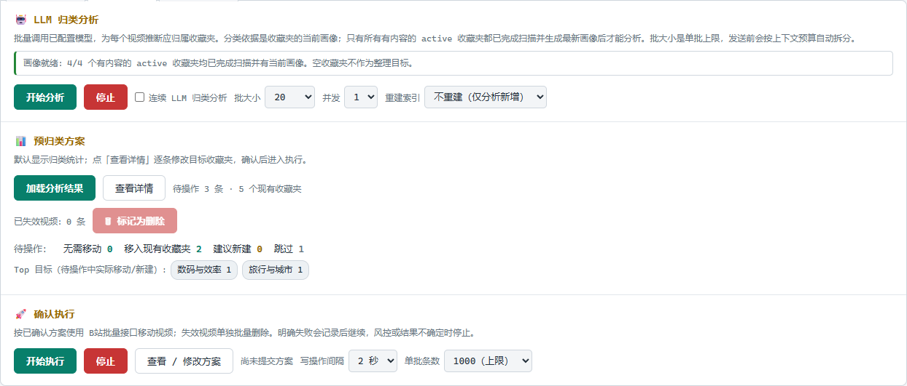

检查完点“确认方案（进入执行）”。如果将失效视频标记为删除，也要单独复核这些条目。此时仍只是已确认待执行方案。

### 第四步：执行已确认方案

点“开始执行”。程序会按默认间隔逐步移动视频；执行完成后去 B 站核对结果。看到“结果不确定 / unknown”时，先看日志并检查 B 站，不要直接重复提交同一写操作。

### 手动收藏夹整理

如果要合并收藏夹，打开“收藏夹整理”并点“生成 AI 合并建议”。检查每组的目标、来源、最终名称和“清空后删除来源夹”选项；你也可以直接编辑草稿。点“提交合并任务”后，程序会显示待执行清单；再点“执行已提交任务”才会修改 B 站。

上方的“合并组草稿”是可编辑建议；下方的“已提交合并任务”是即将执行的清单。两处核对一致后再启动执行。

<!-- pagebreak -->

## 5. 本地数据、换电脑和常见问题

### 数据保存在哪里？如何备份？

正常便携版会把数据保存在当前 Windows 用户目录：`%LOCALAPPDATA%\BiliFavOrganizer\`。按 **Win + R**，粘贴该路径并回车即可打开。

- `config.json` 保存普通设置；`secrets.json` 保存 B 站 Cookie 和旧版单供应商配置中的全局 API Key。
- `data\library.sqlite3` 保存收藏夹目录、视频索引、画像、分析结果、执行状态，以及供应商/模型配置和当前供应商 API Key。
- **不要分享整个目录**；它含有登录凭据和 API Key。

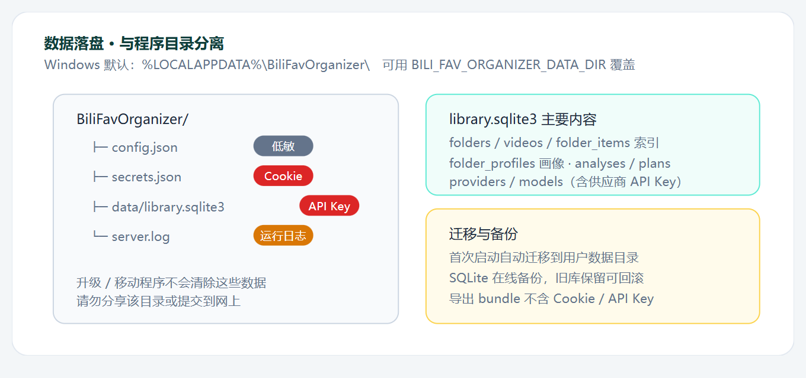

需要迁移项目数据时，可从页面顶部的导入、导出按钮开始：

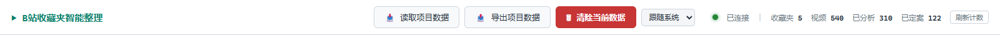

要换电脑，可点页面顶部“导出项目数据”，在新电脑点“读取项目数据”。项目导出用于迁移收藏索引、画像和整理结果，不包含 Cookie、API Key 或供应商/模型配置；新电脑还需重新登录 B 站并配置模型。升级时关闭旧程序，下载新版 ZIP 并解压到新文件夹；个人数据目录会继续使用。

### 收藏夹数量不一致，例如 B 站 32 条、程序读到 31 条

先按提示窗口处理，处理前后都不要继续整理：

1. **推荐：去 B 站手动清理。**检查对应收藏夹，按需要清理失效内容，回到程序点“我已处理，重试扫描”。
2. **不推荐：程序自动清理。**它会修改 B 站收藏夹并移除平台判定失效的内容；先阅读警告，只有明确同意后才能执行。
3. **最后尝试：刷新收藏夹并重扫。**适合目录同步暂时异常，不会清理收藏内容。

只有重扫验证一致，后续整理才会恢复。暂时关闭提示不会解除阻断；首页可点“查看处理提示”重新打开。

<!-- pagebreak -->

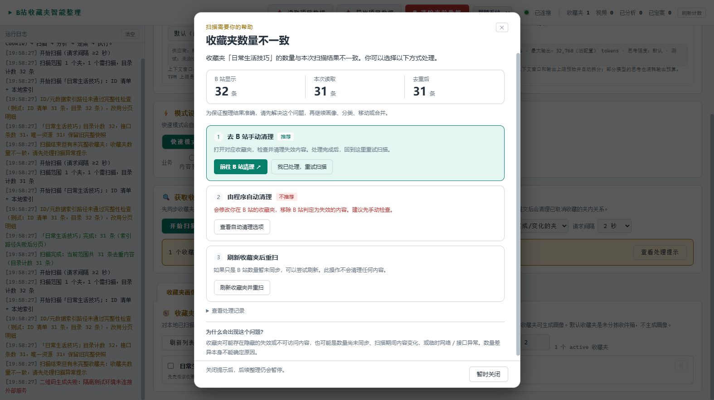

### 其他排查

如果本地页面打不开，确认黑色控制台还在运行，再访问 <http://127.0.0.1:8080> 并查看启动日志。模型测试失败时，检查 API Key、服务地址、模型 ID、账户额度和模型访问权限。收藏夹扫描数量异常时，按上面的提示处理。遇到风控或写入结果不确定，先核对 B 站。

反馈问题时请提供应用版本、当前步骤、报错和脱敏后的截图或日志；不要发送 Cookie、API Key、`secrets.json` 或完整个人数据目录。收藏夹计数不一致的问题可反馈到 [Issue #6](https://github.com/Martin-soaring-dev/bili-fav-organizer/issues/6)。

**规则核验日期：2026-10-07。**供应商活动、额度和价格会变化；注册或充值前请打开文中的官方页面再次确认。
